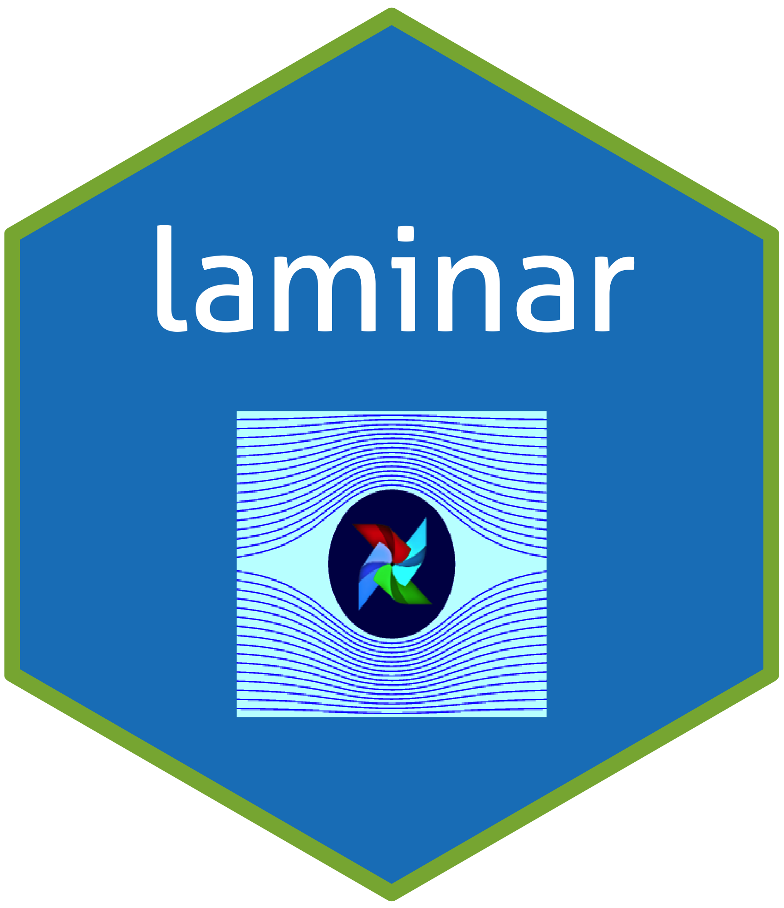

# laminar <a href='https://github.com/misha-lisovich/laminar'></a>

[](https://travis-ci.org/misha-lisovich/laminar)
[](https://opensource.org/licenses/MIT)


**NOTE: this package is under active development, and should be considered pre-alpha.**

Laminar aims to make for a smoother Apache Airflow admin experience by providing a Shiny-based UI which: 

1. Provides a real-time, globally-consistent state for all Airflow DAGs and tasks
2. Allows for simpler CRUD operations by taking care of the complex interrelationships between DAG Python files, DAG objects, Database metadata, Scheduler process memory and Webserver process memory to present a single logical DAG entity with straigtforward create/edit/delete mechanics.

## Installation

Laminar is only available on Github. You can install it with: 

``` r
require('devtools')
devtools::install_github("misha-lisovich/laminar")
```

Laminar requires a running Airflow instance backed by a DBI-compliant database. The best way to experience it is by using the included Docker/Docker-Compose files.


## Docker Image

Clone the laminar directory to your computer. 

To run the laminar docker setup, navigate to the root laminar directory and type:

``` bash
docker-compose -f inst/docker/docker-compose.yaml up -d
```

This will bring up linked containers containing:

* **Apache Airflow** from [puckel/docker-airflow](https://hub.docker.com/r/puckel/docker-airflow/)
* **Postgres** database [dockerhub/postgres](https://hub.docker.com/_/postgres)
* **Laminar** image derived from [rocker/shiny](https://hub.docker.com/r/rocker/shiny/)

To test drive the app, bring up:

1. **Airflow UI** at http://0.0.0.0:8080/admin
2. **Laminar UI** at http://0.0.0.0:3838/apps/laminar_app

Try switching on and running example_bash_operator in the Airflow UI, and observing real-time job progress through the Laminar UI. Try running the same job through the Laminar UI by selecting it, and pressing 'Trigger' or 'Pause/Unpause' from the contextual menu. Reload the Airflow UI to verify the changes.

## Build

To build the laminar docker image, navigate to the root laminar directory and type:

``` bash
docker build -t mul118/laminar -f inst/docker/laminar/Dockerfile .
```

## Custom Settings

Laminar uses Rstudio's [config](https://github.com/rstudio/config) package to store & accesss per-environment settings. To customize settings modify the config.yaml file located in inst/laminar_app, then reinstall/rebuild as needed.

